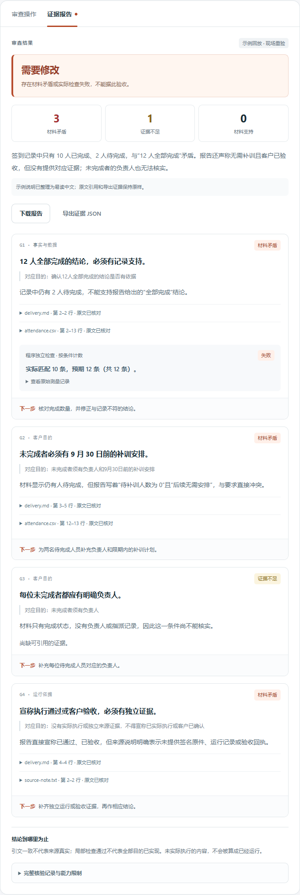

# Delivery Note · Outcome acceptance

## Interface refresh — 22 September

The same demo now has a Chinese-first interface with a separate English switch, responsive material/review/report panels, readable findings and localized Markdown downloads. Source quotations and evidence JSON remain unmodified. The prompt and machine records are available on demand instead of dominating the page. Click **运行示例** (Chinese) or **Run the example** (English); this rechecks the real recorded SERV case, not a new model request.

Browser interaction and desktop/mobile checks are documented in [UI_REVIEW.md](UI_REVIEW.md). This refresh does not broaden the underlying verification scope or create a new contest entry.

**Not just “is there a deliverable?” — “does the evidence support the customer's objective?”**

A goal-driven acceptance workbench built with SERV Reasoning. AI proposes an explicit acceptance contract and explains gaps. A deterministic engine checks actual bytes; an optional fresh, offline browser executes real user journeys. AI never controls the authoritative verdict.

## Product direction / 产品定位

This is a **general-purpose, customer-goal-driven delivery audit**, not a website testing product. Browser automation is one evidence adapter. Documents, data, programs and full systems need different inspection methods but share the same purpose → criteria → checks → evidence → conclusion workflow.

**项目目标是通用交付审查。** 当前是通用框架与第一批文件、数据和静态网页检查能力，不是已经能够自动验收任意交付物。下一步应补强目的拆解、内容与事实审查、不同类型的执行验证，而不是只围绕网页演示扩张。

See [PRODUCT_SCOPE.md](PRODUCT_SCOPE.md) for the fixed product goal, current boundaries and development priorities.

## v0.3 — the same entry, expanded to general delivery review

- The public UI now defaults to English; Chinese is available from the language switch. The recorded training example also shows an English customer objective and English finding explanations in English mode, while exact source quotations remain unchanged.


The main demo now starts with **customer-purpose review of actual documents, data and code-as-text**, rather than the old synthetic-count handoff message. The previous deterministic data/web workbench remains at `checks.html`; the original SERV recordings remain at `legacy/`. Existing repository, demo and contest entry URLs are preserved.

**Try the main demo:** click “Run the example” (or “运行示例”). Actual file parsing, 10 completed / 2 pending counts, exact goal/line quotation validation and the model-selected bounded count check run anew. The SERV response itself is a clearly labelled real browser recording, not a new inference request. It identifies the false completion claim, missing follow-up ownership/schedule, and unsupported execution/acceptance claims.

For a new delivery, enter the goal, select reference and deliverable text files, inspect the full-material prompt and explicitly consent. The same engine accepts the model's structured audit, rejects altered quotations or stale packets, executes supported data checks, and exports a report with objective → criteria → source evidence → measured findings. Semantic support and measured tests are shown separately: passing a narrow test cannot prove an entire business purpose.

### Three honest model routes

- **Public static site:** recorded SERV demonstration, fresh local checks and portable prompt/response import. No embedded key, visitor login, paid call or automatic data upload.
- **Existing assistant and signed-in browser:** `python -m delivery_note.app --agent-review --max-calls 3` or `start-browser-review.cmd`. The user opts in; the local service queues a task; an existing authorized AI assistant uses its browser tools to submit to SERV and return the result. The app validates and evaluates it. This mode requires the assistant; a standalone web page cannot control another website. See [AGENT_REVIEW.md](AGENT_REVIEW.md). Queue/return boundaries are tested. A real connected-assistant browser round trip is recorded in `verification/live-agent-request.json`, `live-agent-response.json` and `live-agent-result.json`, and revalidated against the published engine in `verification/consolidated-live-result.json`. This still requires a connected assistant; it is not a standalone web page autonomously controlling SERV.
- **Optional local API:** the user may configure their own server-side SERV key. The full-text general-review endpoint is tested with substituted provider responses; those tests are not live API evidence. Browser model experiments are recorded separately. Never put keys in client code.

**Verified model evidence:** `verification/serv-goal-tools-20260922.json` contains the actual completed SERV-side browser response and observed usage; `verification/serv-goal-tools-validated.json` contains the independent recheck of that response against file bytes. The helper prompt was condensed for the browser, with the objective and every source line preserved. This is a browser observation, not a cryptographic provider receipt. The Playground comparison also runs a raw model; the displayed SERV-side amount is not the total comparison cost.

**Scope:** this is a general-purpose audit workflow with concrete text/document/data and offline static-web adapters, not a guarantee of complete inspection of arbitrary systems. Code is reviewed as text unless the separate supported offline browser check is explicitly authorized. Binary Office/PDF parsing, arbitrary program execution, authenticated production systems, and independent real-world fact verification are not implemented. Missing evidence remains unverified; model reasoning and complete goal coverage still need independent review. The report is not a customer-acceptance certificate.

## What changed in v0.2

The original three recorded SERV examples remain intact under **`legacy/`**. The new workbench checks **real selected files**, not placeholder hashes or saved verdicts. English and Chinese UI are available.

1. Describe the customer's purpose and mark files as **source** or **delivery**.
2. Start from an example, write acceptance rules, or explicitly ask SERV to propose them.
3. Confirm the scope. Run byte-level, structural, source/data and optional runtime checks.
4. Get a requirement → evidence → file hash chain, blocking gaps, and downloadable JSON/Markdown reports.

A mandatory failure blocks acceptance; absent evidence stays **unverified**. No average score can erase a critical failure. “Criteria satisfied” is bounded to the confirmed contract, not a universal guarantee.

## Four working examples

- **Right count, wrong data:** an output quietly changes 50 to 500. Its row counts, uniqueness and totals agree. Independent source recomputation still catches it.
- **Correct data:** trim fields, deduplicate by order ID retaining the first record, preserve order, check every output cell, and reconcile a summary.
- **It opens, but fails the purpose:** a quotation page works for normal orders but mishandles discounts and invalid quantities.
- **Actual working journey:** the isolated browser fills inputs, clicks the button, and asserts normal, discount and invalid-input results.

Example files are invented. Each click runs fresh checks. Web examples on the static site are honestly **unverified at runtime**; the local service performs the real browser steps.

## Run locally

Requires **Python 3.10+ and Node.js 20+**. No npm dependencies or build system.

```sh
python -m delivery_note.app
```

Open `http://127.0.0.1:8766`. Without a key, local file checks still work and no AI requests occur.

For SERV, put your key only in the server environment (`SERV_API_KEY`) or an explicit private file:

```sh
python -m delivery_note.app --key-file /absolute/private/path/to/key.txt --max-calls 3
```

The key is never served to the browser. `--max-calls 0` disables all provider calls; 0–6 attempts per process are allowed, failures count, and there are no retries or top-ups. Restarting resets this process limit; it is **not an account-wide budget cap**. Calls use the existing `gpt-5.6-luna` SERV integration.

**Data consent:** offline file checks stay in the page or local server. SERV planning receives the objective, filenames, roles, CSV headers and HTML control IDs/types — not file bodies or input values. Optional explanation sends the derived report. Both require an explicit unchecked-by-default consent control. Organization-level provider data collection may apply; do not send confidential material. Reports are kept only in page memory and a four-entry local process cache; closing the processes clears them. Downloads are explicit.

### Actual web execution

Install Playwright only when web journeys are needed:

```sh
python -m pip install playwright
```

Windows uses an already-installed Microsoft Edge **in a new isolated process/profile**, never the user's logged-in session. On other systems run `python -m playwright install chromium` once. Chromium's sandbox stays enabled. The runner serves only the supplied files at a virtual origin, blocks outside requests, WebSockets, service workers and downloads, and uses a fixed action vocabulary. There is no uploaded Python/Node/shell execution, remote navigation, `eval` or arbitrary tool command.

Each journey needs an interaction and an observable assertion. Runtime receipts are bound to the exact objective, rules and file-byte snapshot. Changing any of them invalidates the receipt. Missing dependencies, blocked backends or runner failures are surfaced rather than silently passed. Browser execution is bounded to six journeys / twelve steps per journey and a 45-second process limit.

This is **not** a hostile-code security sandbox or penetration-test guarantee. Do not use it for malicious/untrusted executable samples. Production APIs, authenticated services and arbitrary programs are outside this release's execution scope.

### Free static mode

```sh
python -m http.server 8767 --directory docs
```

The GitHub Pages client uses the **same** `core.mjs` engine as the local Node runner. Real file hashing, CSV/JSON parsing, content checks and data recomputation work with no provider, key or upload. AI planning and real browser execution require the local service. `legacy/` retains the original labelled SERV recordings.

## Evidence layers and supported rules

| Layer | Evidence in this release |
|---|---|
| 1 · Files | Real byte count, SHA-256, optional expected hash; rejects unsafe/duplicate paths |
| 2 · Structure | Strict CSV including quoted newlines/CRLF/BOM, JSON parsing, required columns, literal text presence |
| 3 · Facts / data | Actual record counts, uniqueness, required values, exact source recomputation, fixed-point sums vs JSON, JSON-pointer expected values |
| 4 · Runtime | Fresh offline browser: fill, click, assert exact text/value/count; never infer execution from a report |
| 5 · Purpose | Mandatory criterion gate + explicit customer-goal scope; unsupported conditions stay unverified |

The JSON contract uses `file_exists`, `sha256`, `csv_columns`, `csv_row_count`, `csv_unique`, `csv_not_empty`, `csv_transform`, `sum_matches_json`, `json_value`, `text_includes`, `browser_flow`, and `manual`. See `delivery_note/web/cases.json` for complete runnable contracts. The source in `csv_transform` must have the reference role; a sum against a delivered CSV only establishes internal agreement unless another criterion anchors it to a reference.

Only UTF-8 text / CSV / JSON / static web files are supported, maximum 40 files and 2 MiB. No zip extraction. A text claim saying “passed”, “received” or “paid” is not proof. Source agreement is not authentication of source truth. Scope completeness still needs customer/human confirmation. Models can miss requirements; no “all purposes automatically proven” claim is made.

## Validation and development

```sh
python -m unittest discover -s preflight -p "test_*.py" -v
node --test preflight/test_goal_engine.mjs
python scripts/sync_web.py
```

Original sample/API tests are preserved. New tests target same-count corruption, actual hashes, stale evidence, missing goal coverage, quoted CSV, decimal arithmetic, unsafe paths, unsupported commands, consent, privacy and provider failure budgets. Real browser and live SERV verification are recorded separately in `UPGRADE_NOTES.md`; mocked provider tests are not live inference.

Edit `delivery_note/web`, then run `scripts/sync_web.py` to sync `docs`. This **does not publish or deploy**. The current revision updates the same public repository and demo; it does not itself resubmit a competition form or change account settings. See CONTEST_UPDATE.md for the existing entry amendment.

## Contest and references

Built for the September 2026 SERV Hackathon Open Track. Prior submission status and any award are not implied by functionality. The official contest page lists creativity, user-readiness and revenue potential as criteria. No customers, income or awards are claimed.

- Official integration: https://docs.openserv.ai/serv-reasoning/sdk-integration
- Official contest: https://www.openserv.ai/hackathon
- Browser launch/isolation API: https://playwright.dev/python/docs/api/class-browsertype

MIT licensed.

## Existing-entry update and public screenshot

The existing competition entry was updated in place; the public amendment is attached to the original X conversation. See [CONTEST_UPDATE.md](CONTEST_UPDATE.md) for the verified update URL and exact status, including the unchanged original submission.


